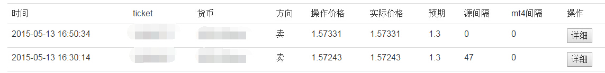
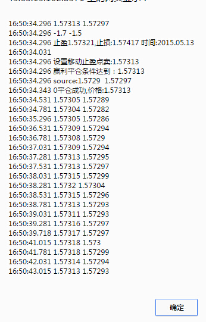
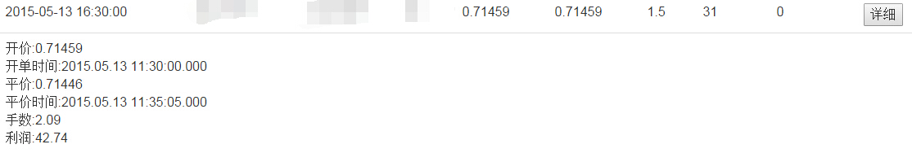

### **不同平台的情况是不一样的，所以，我们需要有针对性的根据已经做到的单子对平台的参数进行优化**
***

#### 在前台，如果系统有做单，你应该可以看到如下情况

* 每一单都有这样一条数据
* 可以查看这一单下单时候的相关情况
* 通过操作价格和实际价格，可以看到这一单是否有滑点，了解平台的情况
* 源间隔是指操作这一单的时候，源价格是多少毫秒前的

#### 试试点击详细

* 16.50.34.031 系统下单
* 16.50.34.296 系统收到下单成功消息
* 由以上两条可以得知平台对下单的反应时间
* 16.50.34.296 系统同时收到平台的最新价格，并且根据后台的相关设置盈利平单
* 16.50.34.343 平单成功，且平单没有滑点
* 平单成功前面的0=没有进行多次平单
* 从开始下单，系统会保存该货币对的20多个价格，即使已经平单，便于优化后台参数

#### 当然，你也可以直接点击这条数据

**不需要再看MT4了吧**

***
### **更强大的分析功能和相关使用，请[联系我们](README.md)**
