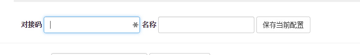
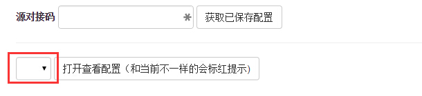

#功能介绍
在系统的具体使用过程中，我们发现大家经常要换平台。但是不同的平台参数配置和调优都是不一样的。所以，就有必要将调好的参数保存下来，以便下一次使用。
***
#保存配置
在配置页面里里，输入要当前配置文件的名称，然后点击保存，即可

* 对接码会自动提取当前的，所以一般情况下不需要输入
* 如果名称和以前保存的有相同的，则会覆盖**（不会提示）**
* 每人最多保存30个配置文件

#获取配置
点击获取配置可以根据当前的源识别码提取所有已保存的配置信息，会在下面的选择栏里出现

#载入配置
点击打开配置，试试吧（放心，不会马上覆盖当前的~）